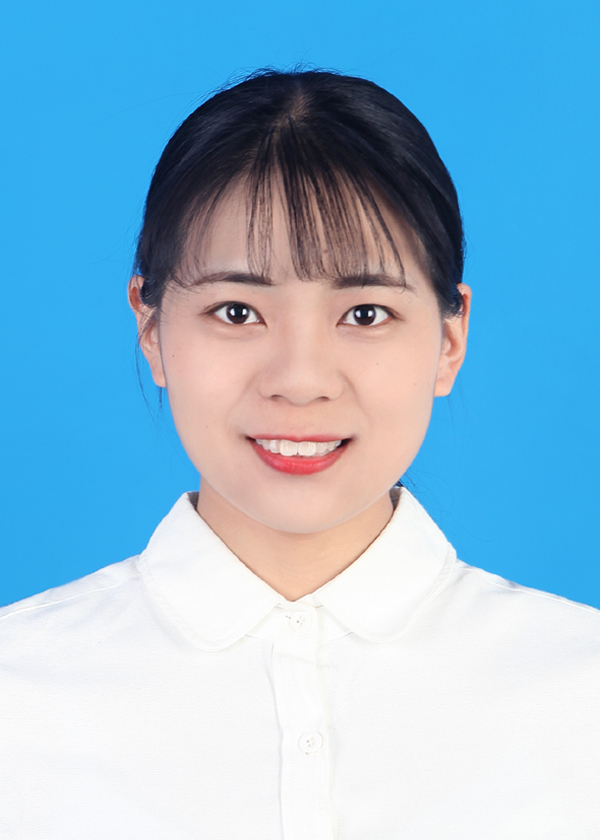

I'm Yuqing Xing, and I earned my PhD from the School of Mathematics and Statistics at [Huazhong University of Science and Technology](https://www.hust.edu.cn/), China, in 2026.

My adviser is [Quan Zheng](http://maths.hust.edu.cn/info/1094/2635.htm). 

Major: Mathematics

Research Interests: Mathematical theory of deep learning, Topological data analysis

Hobbies: Plants, Jogging

Chinese Name: 邢雨晴

<!---

-->

## Contact
Email：2502864385@qq.com; yuqingxing@hust.edu.cn

## Education

2020.09-2026.06 : Doctor, [Huazhong University of Science and Technology](https://english.hust.edu.cn/)

2019.09-2020.07 : Graduate, [Huazhong University of Science and Technology](http://english.hust.edu.cn/)

2014.09-2019.07 : Undergraduate, [Nanchang Hangkong University](https://www.nchu.edu.cn/)

## Publication

1. **Yuqing Xing**, Haodong Chen, Quan Zheng. [ToBaFu: Topology-Based Fusion Model for Classification of Two-dimensional Cancer Images](https://www.sciencedirect.com/science/article/pii/S0893608025009979). Neural Networks, Volume 194, February 2026, 108117.

2. Peng Wang, Jiayi Duan, **Yuqing Xing**, Ruihang Xu, Anyuan Xu, Haodong Chen, Shengchao Hu, Tao Wang, Shuang Liu. [Explainable anomaly detection and localization for ADHD in MRI using topological feature](https://www.sciencedirect.com/science/article/pii/S0031320326013129). Pattern Recognition, Volume 180,  June 2026, 114347.

## Presentation
1. <a href="Quantification of plant leaf morphology based on TDA.pdf" target="_blank">Quantification of plant leaf morphology based on TDA</a>, February, 2022.

2. <a href="The Seifert-van Kampen Theorem in Category.pdf" target="_blank">The Seifert-van Kampen Theorem in Category</a>, June, 2020.
